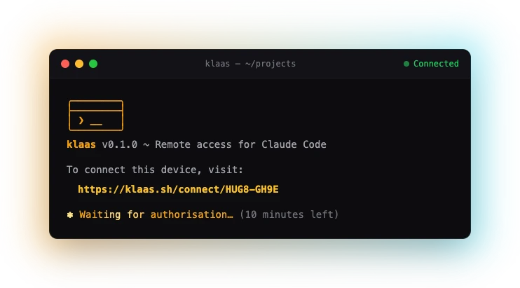

<p align="center">
  <a href="https://klaas.sh">
    <picture>
      <source media="(prefers-color-scheme: dark)" srcset="logo-banner-dark.svg">
      <source media="(prefers-color-scheme: light)" srcset="logo-banner-light.svg">
      
    </picture>
  </a>
</p>

<p align="center">
  <a href="https://github.com/klaas-sh/cli/releases"></a>
  <a href="https://github.com/klaas-sh/cli/blob/main/LICENSE"></a>
  <a href="https://klaas.sh"></a>
</p>

<p align="center">
  <picture>
    <source srcset="terminal-animation.avif" type="image/avif">
    
  </picture>
</p>

---

## What is klaas?

**klaas** wraps your AI coding agent sessions and streams them to the cloud,
enabling remote access from any device via a web interface. Perfect for:

- **Real-time streaming** - See terminal output character by character, as it
  happens
- **Multi-device access** - Start on desktop, check progress from your phone
- **Remote approval** - Approve tool calls from anywhere when your agent needs
  permission
- **Remote instructions** - Send prompts and guide your agent from any device
- **End-to-end encrypted** - Your sessions are encrypted. We can't read them.

## Supported Agents

| Agent | Shortcut | Hooks |
|-------|----------|-------|
| [Claude Code](https://code.claude.com/) | `[A]` | Full |
| [Gemini CLI](https://ai.google.dev/gemini-cli) | `[G]` | Full |
| [Codex CLI](https://openai.com/codex) | `[O]` | Partial |
| [GitHub Copilot](https://github.com/features/copilot) | `[C]` | - |
| [Vibe CLI](https://mistral.ai/) | `[M]` | - |
| [Aider](https://aider.chat/) | - | - |
| [Goose](https://github.com/block/goose) | - | - |
| [Open Interpreter](https://openinterpreter.com/) | - | - |

You can also configure your own agent.

## Installation

### macOS / Linux / WSL

```bash
curl -fsSL https://klaas.sh/install.sh | bash
```

### Windows PowerShell

```powershell
irm https://klaas.sh/install.ps1 | iex
```

### Homebrew (macOS/Linux)

```bash
brew install klaas-sh/tap/klaas
```

### Scoop (Windows)

```powershell
scoop bucket add klaas https://github.com/klaas-sh/scoop-bucket
scoop install klaas
```

### Nix (NixOS/Linux/macOS)

Requires [Nix](https://nixos.org/download/) with
[flakes enabled](https://nixos.wiki/wiki/Flakes#Enable_flakes_permanently).
To enable flakes, add to `~/.config/nix/nix.conf`:

```
experimental-features = nix-command flakes
```

Then install klaas:

```bash
# Run directly without installing
nix run github:klaas-sh/cli

# Install to profile
nix profile install github:klaas-sh/cli
```

## Usage

### Starting Sessions (Host Mode)

```bash
# Auto-detect installed agent (interactive if multiple)
klaas

# Use a specific agent
klaas --agent claude
klaas -a gemini

# Name your session for easy reconnection
klaas --name refactor-tests
klaas -n api-work

# Resume the previous session
klaas --resume

# Pass arguments to the agent (after --)
klaas -- --model sonnet --allowedTools "Bash(git*)"
```

On first run, you'll be prompted to authenticate via your browser. Once
authenticated, your session is automatically streamed to the klaas dashboard.

### Connecting to Sessions (Guest Mode)

```bash
# List your sessions (interactive selection)
klaas sessions

# Connect to a session by name
klaas connect refactor-tests
klaas connect api-work

# Connect to a session by ID
klaas connect 01HQXK7V8G3N5M2R4P6T1W9Y0Z
```

When connected as a guest, you have full terminal interaction - you can see
output and send input just like the host.

### Other Commands

```bash
# List installed agents
klaas agents

# Upgrade to the latest version
klaas upgrade

# Uninstall klaas
klaas uninstall
```

## How It Works

```
┌─────────────┐     ┌─────────────┐     ┌─────────────┐
│   klaas     │────▶│   Agent     │────▶│  Terminal   │
│   CLI       │◀────│   CLI       │◀────│  Output     │
└─────────────┘     └─────────────┘     └─────────────┘
       │                                       │
       │         ┌─────────────┐               │
       └────────▶│   klaas     │◀──────────────┘
        (E2EE)   │   Cloud     │
                 └─────────────┘
                       │
                 ┌─────────────┐
                 │    Web      │
                 │  Dashboard  │
                 └─────────────┘
```

1. **klaas** detects installed agents and spawns your choice in a PTY
2. All input/output is captured and encrypted client-side
3. Encrypted output is streamed to the klaas cloud in real-time
4. Access your session from the web dashboard at [klaas.sh](https://klaas.sh)
5. For agents with hooks support, permission requests trigger notifications

## Commands

### Flags

| Short | Long | Description |
|-------|------|-------------|
| `-a` | `--agent <AGENT>` | Start with specific agent |
| `-n` | `--name <NAME>` | Set a name for this session (must be unique) |
| `-r` | `--resume` | Resume previous session |
| `-v` | `--version` | Show version |
| `-h` | `--help` | Show help |

### Subcommands

| Command | Description |
|---------|-------------|
| `klaas agents` | List installed agents |
| `klaas connect <id\|name>` | Connect to a session as guest |
| `klaas sessions` | List your sessions (interactive selection) |
| `klaas uninstall` | Uninstall klaas |
| `klaas upgrade` | Upgrade to the latest version |

### Terminology

| Term | Description |
|------|-------------|
| **Host** | The CLI that started the session (owns the PTY) |
| **Guest** | Any client viewing/interacting with a session |

The CLI can act as both host (when starting sessions) and guest (when
connecting to existing sessions).

## Configuration

klaas stores credentials securely in your system keychain (macOS Keychain,
Windows Credential Manager, or Linux Secret Service).

### Configuration File

Create `.klaas/config.toml` in your project or `~/.klaas/config.toml` globally:

```toml
# Default agent when multiple are available
default_agent = "claude"

# Only show these agents (even if others are installed)
only = ["claude", "gemini"]

# Or add custom agents alongside built-in ones
also = ["my-custom-agent"]

# Define custom agents
[agents.my-custom-agent]
command = "/path/to/my-agent"
name = "My Custom Agent"
hooks_type = "claude"  # "claude", "gemini", "codex", or "none"
shortcut = "X"

# Disable anonymous analytics (tracks install/upgrade/uninstall
# events with version and platform only, no personal data)
analytics = false
```

## Building from Source

```bash
# Clone the repository
git clone https://github.com/klaas-sh/cli.git
cd cli

# Build
cargo build --release

# Run
./target/release/klaas
```

## License

MIT License - see [LICENSE](LICENSE) for details.

## Links

- [Website](https://klaas.sh)
- [Documentation](https://klaas.sh/docs)
- [Dashboard](https://app.klaas.sh/)
- [Report Issues](https://github.com/klaas-sh/cli/issues)
